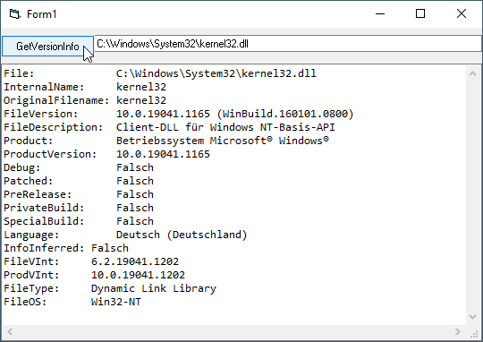

# IO_FileVersionInfo  
## Reads from the file resources of system files like dlls or exe, and shows version information   

 

This repo contains the class FileVersionInfo. It works like the same class in .net namespace System.Diagnostics  
The function GetFileVersionInfo is now the constructor.  
Works with unicode or ansi, works in VB6 (aka VBC) as well as in VBA x86 and x64  
You may also have a look at the tutorial: [VB-anywhere](https://github.com/OlimilO1402/XL_VBanywhere)  
  
Project started around jan.2007.  

some useful links:
https://stackoverflow.com/questions/26151534/whats-the-supportedos-guid-for-windows-10

https://stackoverflow.com/questions/25986331/how-to-determine-windows-version-in-future-proof-way/25986612#25986612

(see the answer to the question)
https://docs.microsoft.com/de-de/windows/win32/sbscs/application-manifests?redirectedfrom=MSDN

https://en.wikipedia.org/wiki/List_of_Microsoft_Windows_versions
